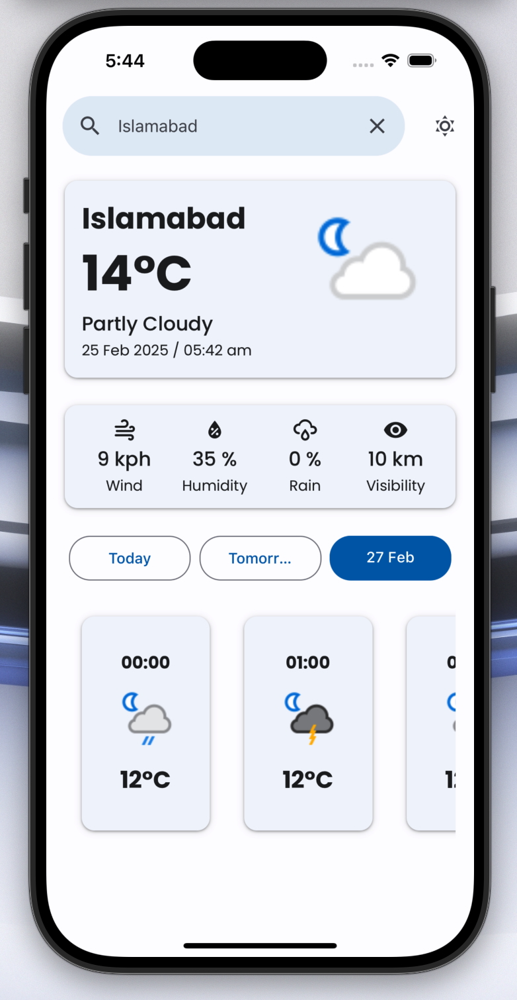
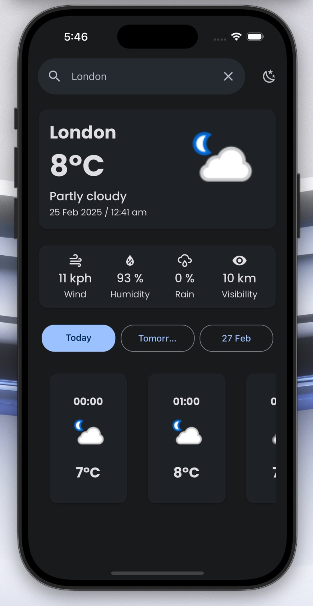

# Weather App with React Native and Expo

A simple Weather app built with **React Native**, **Expo**, and **Redux** for state management. This project was created to learn and explore modern tools for building mobile applications.

## Screenshots

## Features
- Dynamic Search: Users can search for weather data by entering a city name.
- Real-Time Data: Fetches current weather conditions, including temperature, humidity, wind speed, visibility, and more.
- Error Handling: Robust error handling ensures a smooth user experience.
- Light & Dark Mode: Supports both themes for a seamless experience.
- Responsive Design: Works flawlessly across iOS and Android devices.
- State Management: Uses Redux for efficient state management.
- Navigation: Built with React Navigation for smooth transitions between screens.
- EAS Configured: Set up with Expo Application Services (EAS) for easy builds and deployments.

## Tech Stack
- **React Native**: For building cross-platform mobile apps.
- **Expo**: For rapid development and testing.
- **Redux**: For effective and reliable state management.
- **TypeScript**: For type-safe code.
- **React Native Paper**: For a polished and customizable UI.
- **React Native Size Matters**: For handling responsiveness.

## Getting Started

### Prerequisites
- Node.js (v16 or higher)
- Expo CLI (install globally using `npm install -g expo-cli`)
- Git

### Installation
1. **Clone the repository**:
   `git clone https://github.com/haris-0525/WeatherWorld.git`
   `cd WeatherWorld`
2. Install dependencies:
 `yarn install`
3. Set up environment variables:
Create a .env file in the root directory.
Add your WeatherAPI key:
 `WEATHER_API_KEY=your_api_key_here  `

5. Start the development server:
 `yarn start`
6. Open the app on your device:
   Scan the QR code with the Expo Go app (available on iOS and Android).
   Alternatively, run on an emulator
   `yarn android` or simulator `yarn ios`
7. To build the app for iOS or Android, use EAS:
   `eas build --platform android` or `eas build --platform ios`

## Contributing
Contributions are welcome! If you'd like to contribute, please follow these steps:

1. Fork the repository:
 `git clone https://github.com/haris-0525/WeatherWorld.git`
 `cd WeatherWorld`
3. Create a new branch:
`git checkout -b feature/your-feature`
4. Commit your changes: 
`git commit -m 'Add some feature'`
5. Push to the branch:
`git push origin feature/your-feature`
6. Open a pull request.

## Acknowledgements
1. Expo for the amazing development tools.
2. Redux for effective state management.
3. React Native Paper for the beautiful UI components
4. React Native Size Matters for handling responsiveness.
5. WeatherAPI.com for providing the weather data.

6. <!-- LICENSE -->
# License

Distributed under the `MIT` License. See [LICENSE](https://github.com/haris-0525/WeatherWorld/blob/main/LICENSE) for more information.

Made with ❤️ by Haris Amjad
